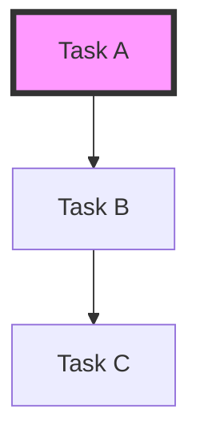

# Epic 2.2: Graph Lifecycle & Performance Propagation Implementation Plan

**Created:** 2026-02-22
**Epic:** Epic 2.2: Graph Lifecycle & Performance Propagation
**Status:** Planned
**Target Package:** `pkg/graph`, `pkg/cmd`

---

## Executive Summary

This plan addresses performance bottlenecks in priority management and expands CLI diagnostic capabilities. It also ensures strict synchronization between the in-memory graph state and the Dolt database across all CRUD operations.

### Key Objectives

1.  **Priority Propagation**: Implement active bubbling of priority changes to ensure $O(1)$ read performance for effective priority.
2.  **Visualization Expansion**: Add Mermaid.js support for seamless documentation integration.
3.  **Impact Analysis**: Provide CLI tools to visualize the downstream "blast radius" of task delays.
4.  **Database Synchronization**: Formally verify that every graph mutation (Create, Read, Update, Delete) is correctly reflected in the database.

---

## 1. Task Breakdown

### Phase 1: Advanced Propagation & Caching
*   **[grava-1f45.2.1] Proactive Priority Bubbling**: 
    *   Implement `PropagatePriorityInvalidation` to trigger when a node's priority or status changes.
    *   Optimize `GraphCache` to maintain a pre-calculated effective priority map.

### Phase 2: CLI Insights & Visualization
*   **[grava-1f45.2.2] Mermaid Export Support**:
    *   Add `--format mermaid` to `grava graph visualize`.
    *   Implement Mermaid flowchart generation (DAG to Mermaid syntax).
*   **[grava-1f45.2.3] CLI Impact Analysis (Reverse Tree)**:
    *   Implement `grava dep impact <id>` command.
    *   Build `printImpactTree` to show successors (downstream dependents) recursively.

### Phase 3: CRUD Database Integrity Audit
*   **[grava-1f45.2.4] CRUD Audit: Create Operations**: 
    *   Verify `AddNode` and `AddEdge` properly commit to DB and update Wisp indicators.
*   **[grava-1f45.2.5] CRUD Audit: Read Operations**: 
    *   Ensure `LoadGraphFromDB` captures all metadata correctly and handles stale cache scenarios.
*   **[grava-1f45.2.6] CRUD Audit: Update Operations**: 
    *   Verify `SetNodeStatus` and priority updates propagate to the DB `issues` table and trigger cache refreshes.
*   **[grava-1f45.2.7] CRUD Audit: Delete Operations**: 
    *   Ensure `RemoveNode` and `RemoveEdge` cleanup both the `issues`/`dependencies` tables and the in-memory adjacency lists.

---

## 2. Technical Details

### 2.1 Priority Bubbling Logic
When a node $N$'s priority changes from $P1$ to $P2$:
1.  Update $N$ in the cache.
2.  Find all immediate predecessors (tasks depending on $N$).
3.  If $N$'s new priority is higher (lower number) than a predecessor's current effective priority, update the predecessor and recurse.
4.  If $N$'s new priority is lower (higher number), trigger a re-computation of predecessors' effective priority by checking all their blocking successors.

### 2.2 Mermaid Generation
Transform the DAG into:

---

## 3. Verification Plan

*   **Unit Tests**: New tests in `pkg/graph/cache_test.go` for propagation.
*   **Integration Tests**: Test database sync by checking Dolt table state after each `grava` command execution.
*   **CLI Tests**: Verify tree and impact outputs match expected hierarchy for a set of mock issues.
